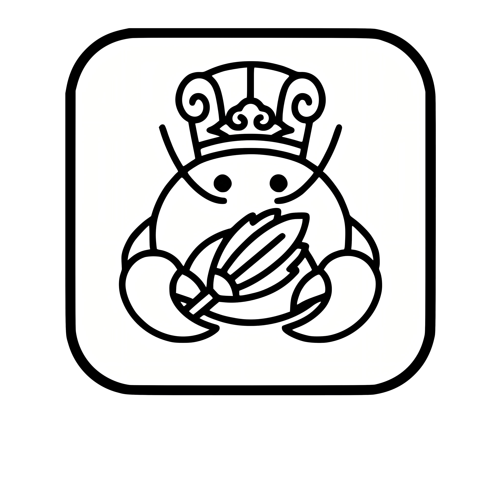

# WorkClaw

[简体中文](README.md) | [English](README.en.md)

<p align="center">
  
</p>

[](LICENSE)
[](https://tauri.app/)
[](https://reactjs.org/)

**Help Everyone Quickly Build Their Own AI Employee Team**

WorkClaw is a beginner-friendly OpenClaw desktop agent distribution that removes command-line and config-file friction. Through conversational interaction, users can install and configure the system, create skills, encrypt/package skills, discover skills across the web, and direct AI teams from mobile via Feishu and other IM channels.

⭐ If you believe AI employee teams should be accessible to everyone, please Star this repository.

## Quick Links

- Getting started: [Getting Started](#getting-started)
- Documentation: [docs/](docs/)
- Releases: [Releases](https://github.com/haojing8312/WorkClaw/releases)
- Roadmap: [Roadmap](#roadmap)
- Contributing & support: [CONTRIBUTING.md](CONTRIBUTING.md) · [SUPPORT.md](SUPPORT.md)

## Project Status

- Stage: `Active Development (MVP)`
- Primary branch: `main`
- Maintenance mode: ongoing feature iteration + stabilization
- Detailed plans and execution logs: [docs/plans/](docs/plans/)

> **🧪 AI-Powered Development Experiment**
> This project is an experimental demonstration of **100% AI-driven development** - the entire codebase is designed and implemented by AI (Claude Code, GPT-5.3-Codex) without manual code inspection by the developer. This serves as a real-world test of AI's capability to build production-grade software autonomously.

## What is WorkClaw?

WorkClaw's core mission is to make AI employee teams usable by everyone, not just technical experts:
- **For non-technical users**: no command line, no manual config editing; complete setup and usage through chat-like interaction
- **For skill creators**: create, test, encrypt, package, and distribute skills through user-friendly agent workflows
- **For software companies (OEM)**: build and monetize B2B offerings on top of the open-source base
- **For individual users**: easily install, configure, and run a personal AI employee team

WorkClaw also benchmarks against Claude Cowork-style desktop agent experiences with a focus on local control, mobile command capability through IM, and team collaboration.

## Core Product Highlights

- **Start tasks in one sentence**: Use the landing page to start local automation and coding tasks quickly.
- **Agent + tools in one chat loop**: The assistant can read/write files, run commands, and show tool traces while responding.
- **Expert Skills workflow**: Create reusable local skills with guided input and real-time `SKILL.md` preview.
- **Built-in packaging flow**: Package skills from the app for secure sharing and distribution.
- **Unified settings control**: Manage models, provider routing, search providers, MCP servers, and runtime options.

## Product Screenshots

### 1) Task Landing


### 2) Expert Skills Hub


### 3) Skill Packaging


### 4) Settings


### 5) Packaging Flow (GIF)


## Architecture

WorkClaw is delivered as a single integrated desktop application:

### Business Architecture


The business architecture showcases the complete value stream from creator to user, organized in 4 layers:
- **Creator Value Chain**: Skill development → package/encrypt → publish
- **Core Platform**: Agent engine, security, tool capabilities, model integration
- **User Value Chain**: Personal (browse → install → run) + Enterprise (team/RBAC → unified config/SSO → Agent employees)
- **Ecosystem Integration**: EvoMap evolution, WorkClaw marketplace + ClawHub compatibility, IM remote calling

### Technical Architecture


The technical stack is organized in 6 layers:
- **Layer 1 - User Interface**: React 18 + TypeScript, shadcn/ui + Tailwind, Tauri 2.0 WebView
- **Layer 2 - Application Services**: Rust Backend, Node.js Sidecar (localhost:8765)
- **Layer 3 - Agent Runtime**: ReAct engine, Sub-Agent isolation, Context management, skillpack-rs encryption
- **Layer 4 - Tool Capabilities**: Native Tools (Read/Write/Glob/Grep), Bash/PowerShell, Browser automation, MCP protocol
- **Layer 5 - Model Integration**: Anthropic API, OpenAI Compatible, Chinese models (MiniMax, DeepSeek, GLM, Qwen, Moonshot)
- **Layer 6 - Data Persistence**: SQLite, .skillpack files, Secure workspace folders

### WorkClaw Application
The integrated environment where users can package, install, and run encrypted Skills:

**Core Agent Capabilities**:
- ✅ **File Operations**: Read, write, edit files with permission control
- ✅ **Code Execution**: Cross-platform Bash/PowerShell command execution
- ✅ **Browser Automation**: Playwright integration for web scraping and automation (via Sidecar)
- ✅ **MCP Integration**: Model Context Protocol server support for extended capabilities
- ✅ **Multi-Agent System**: Sub-Agent task distribution with isolated contexts
- ✅ **Memory Management**: TodoWrite for task tracking, context compression
- ✅ **Web Search**: DuckDuckGo integration for real-time information
- ✅ **Permission System**: Multi-layer security validation

**User Features**:
- Install `.skillpack` files via drag-and-drop or file picker
- Clean chat interface with real-time streaming responses
- No-session landing page with capability intro and scenario templates
- Expert Skills hub (`我的技能`) with guided two-column creation workflow
- Skill packaging entry moved into the Expert Skills domain
- Session history with searchable conversation archives
- Multi-model support (Claude 4.6, GPT-4, MiniMax M2.5, GLM-4, DeepSeek)
- Local secure workspace folder configuration
- No command line required

### Creator Workflow
Creators can develop Skills with **Claude Code** or **VS Code**, then package directly inside the WorkClaw app (no separate Studio client).

## Key Features

### Security & Privacy
- **Military-Grade Encryption**: AES-256-GCM with deterministic key derivation from username
- **Secure Workspace**: Configure trusted local folders for file operations
- **Permission Control**: Multi-layer validation for sensitive operations
- **No Cloud Dependency**: All processing happens locally

### Agent Capabilities
- **ReAct Loop Engine**: Advanced reasoning and action planning
- **Sub-Agent System**: Parallel task execution with isolated contexts
- **Context Compression**: Smart truncation to stay within token limits
- **Tool Registry**: Dynamic tool registration including MCP servers
- **Memory Persistence**: TodoWrite for task tracking across sessions

### Developer Experience
- **Multi-Model Support**: 15+ models across 9 providers
- **Hot Reload**: Real-time Skill updates during development
- **Comprehensive Logging**: Tool call tracing and error diagnostics
- **Cross-Platform**: Windows, macOS, Linux support

## Tech Stack

### App Backend
- **Framework**: Tauri 2.0 (Rust)
- **Database**: SQLite (sqlx)
- **Encryption**: AES-256-GCM (aes-gcm + ring crates)
- **HTTP Client**: reqwest (for LLM APIs)
- **Sidecar**: Node.js 20+ (Playwright, MCP)

### App Frontend
- **UI**: React 18 + TypeScript
- **Components**: shadcn/ui + Tailwind CSS
- **Markdown**: react-markdown + syntax highlighting
- **State**: React hooks (useState, useEffect)

### Shared Packages
- **skillpack-rs**: Encryption, pack/unpack (Rust)
- **model-adapters**: LLM API adapters (future TS package)

## Supported Models

### Latest Cutting-Edge Models (2026)

**Anthropic Claude**:
- Claude 4.6 Sonnet (latest, best reasoning)

**OpenAI**:
- o1 (latest reasoning model)
- GPT-5.3-Codex (latest coding model, 2026)

**Chinese Leading Models**:
- **MiniMax M2.5** (SWE-Bench 80.2%, code generation)
- **GLM-4** (Zhipu AI, strong Chinese comprehension)
- **DeepSeek V3** (math and reasoning)
- **Qwen 2.5** (Alibaba Cloud, multilingual)
- **Moonshot Kimi** (long context)

**Custom Endpoints**: Any OpenAI-compatible API

## Project Structure

```
workclaw/
├── apps/
│   └── runtime/              # WorkClaw desktop application
│       ├── src/              # React frontend
│       ├── src-tauri/        # Rust backend
│       │   ├── src/
│       │   │   ├── agent/    # Agent system (executor, tools, registry)
│       │   │   ├── adapters/ # LLM adapters (Anthropic, OpenAI)
│       │   │   ├── commands/ # Tauri commands (skills, chat, models, mcp, packaging)
│       │   │   └── db.rs     # SQLite schema
│       │   └── tests/        # Integration tests
│       └── sidecar/          # Node.js sidecar (Playwright, MCP)
├── packages/
│   └── skillpack-rs/         # Encryption library (Rust)
├── docs/                     # Documentation
├── reference/                # Open-source project analysis
└── examples/                 # Example Skills
```

## Getting Started

### Prerequisites

- Rust 1.75+
- Node.js 20+
- pnpm

### Development

```bash
# Install dependencies
pnpm install

# Run app in dev mode
pnpm app

# Build for production
pnpm build:app

# Run tests
cd apps/runtime/src-tauri
cargo test
```

### Windows Auto Release (GitHub)

Tag-driven Windows release is enabled via GitHub Actions.

```bash
# 1) Keep versions aligned (apps/runtime/src-tauri/tauri.conf.json -> version)
# 2) Push a semantic version tag (triggers .github/workflows/release-windows.yml)
git tag v0.1.0
git push origin v0.1.0
```

Before publishing, CI validates that `tag(vX.Y.Z)` matches `tauri.conf.json` `version`.

### Installing a Skill

1. Open Runtime application
2. Click "Install Skill" or drag `.skillpack` file to window
3. Enter username (used for decryption key derivation)
4. Configure API keys if needed
5. Start chatting!

## Roadmap

### Now (Current Focus)
- Complete the desktop Agent core loop: task execution, tool usage, Skill install, and packaging.
- Improve first-time user experience: conversational setup, model onboarding, and key UX guidance.
- Increase reliability: regression coverage on critical paths and stronger runtime observability.

### Next
- Ship distribution capabilities: auto-update, cross-platform installers, and release channels.
- Strengthen creator workflows: templates, visual editing, and publishing flow.
- Expand ecosystem connectivity: IM remote control, marketplace compatibility, and mobile collaboration.

### Later
- Enterprise capabilities: multi-tenant, RBAC, audit, SSO, quotas, and billing.
- Agent evolution: EvoMap / GEP / A2A integration with traceable evolution.
- Open ecosystem: ongoing compatibility with OpenClaw / ClawHub.

Detailed planning and execution logs are maintained in [docs/plans/](docs/plans/).

## Why "WorkClaw"?

**Work**: Focuses on real task execution, delivery, and team collaboration  
**Claw**: Draws from the OpenClaw ecosystem and the "lobster crew" metaphor for controllable AI workers

Think of it as **"putting your AI employee team to work under your command."**

## Inspiration

Similar to how Cursor and Claude Code democratized AI-assisted coding, WorkClaw aims to democratize AI Skill distribution. Package your expertise once, distribute securely to thousands.

## Planning Notes

This README keeps a high-level roadmap only. Detailed technical plans and iteration logs live in [docs/plans/](docs/plans/).

## ⚠️ Security Disclaimer

**IMPORTANT - READ BEFORE USE**

Desktop Agents have powerful capabilities including file system access and command execution. This creates inherent security risks:

- **Malicious Skills**: Third parties may distribute `.skillpack` files containing harmful code
- **System Access**: Installed Skills can read, modify, or delete files on your computer
- **Command Execution**: Skills can execute arbitrary shell commands with your user permissions
- **Data Exposure**: Skills may access sensitive data in your workspace folders

**By downloading, installing, or running this software, you acknowledge:**
1. You understand the security risks associated with desktop AI Agents
2. You will only install Skills from trusted sources
3. You will review and configure workspace permissions carefully
4. **The developers assume NO LIABILITY for any damages, data loss, or security breaches** resulting from the use of this software or any Skills installed through it

**If you do not agree to these terms, DO NOT download, install, or run this software.**

For security best practices, see [SECURITY.md](SECURITY.md).

## Advanced Technical Docs (Integrators & Maintainers)

The following docs are optional for most end users and mainly target integrators and maintainers:

- Feishu routing integration (CN): [docs/integrations/feishu-routing.md](docs/integrations/feishu-routing.md)
- Employee identity model (`employee_id`) (CN): [docs/architecture/employee-identity-model.md](docs/architecture/employee-identity-model.md)
- OpenClaw upgrade runbook (CN): [docs/maintainers/openclaw-upgrade.md](docs/maintainers/openclaw-upgrade.md)
- Skill installation troubleshooting (CN): [docs/troubleshooting/skill-installation.md](docs/troubleshooting/skill-installation.md)

## License

Apache 2.0 - see [LICENSE](LICENSE)

## Contributing

Contributions are welcome! Please read [CONTRIBUTING.md](CONTRIBUTING.md) for details.

## Community

- GitHub Issues: Bug reports and feature requests
- Documentation: [docs/](docs/)
- Examples: [examples/](examples/)
- Reference: [reference/](reference/) - Open-source project analysis
- Support channels: [SUPPORT.md](SUPPORT.md)
- Security reporting: [SECURITY.md](SECURITY.md)
- Code of conduct: [CODE_OF_CONDUCT.md](CODE_OF_CONDUCT.md)

## Acknowledgements

- Thanks to the [OpenClaw](https://github.com/openclaw/openclaw) open-source ecosystem for the foundational ideas and capabilities that WorkClaw builds on.

---

**Built with Tauri, React, and Rust** | Inspired by Claude Code, Gemini CLI, and the open-source Agent community
